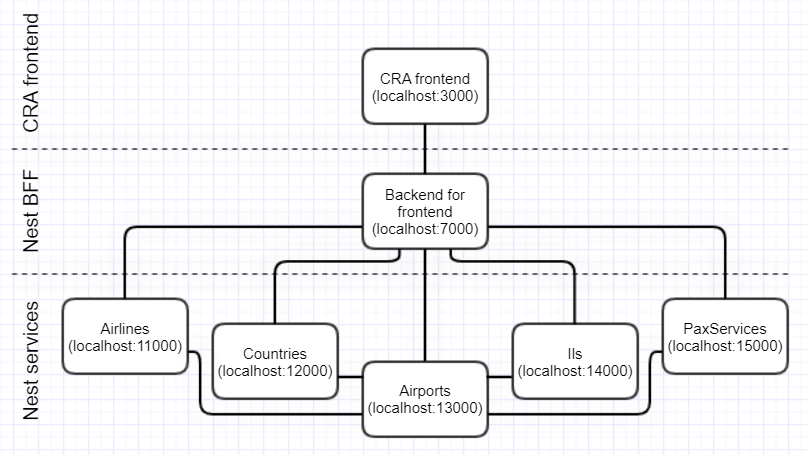

# nest-cra-monorepo

This is a training application for:
- using Backend for frontend architectural pattern (BFF)
- handling backend with Nest.js framework
- storing BFF component and frontend application in a monorepo for sharing interfaces of their communication endpoints

# Architecture schema

The frontend application is a SPA based on Create React App. The application communicates with it's dedicated BFF component which is based on Nest.js framework. The aim of BFF layer is to further proxy requests and map it's responses to the shape, the frontend application should not need to remap anymore. The BFF communicates with series of smaller services. They also are based on Nest.js framework and have strictly narrowed domain (i.e. each service for airports, airlines and countries).

# Starting applications

## `yarn install`

Will install all dependencies on each monorepo's component.

## `yarn --cwd packages/cra start`

Runs frontend app in the development mode. 
It's available on [http://localhost:3000](http://localhost:3000). To make it functional you also must start all connected backend components (listed below).

The page will reload if you make edits.

## `yarn --cwd packages/nest nest start --watch`

Runs BFF Nest.js component in the development mode. 
It's available on [http://localhost:7000](http://localhost:7000) and exposes REST endpoints listed on the console while starting the server.

The component will reload if you make edits.

## `yarn --cwd packages/services nest start airlines --watch`

Runs airlines Nest.js service in the development mode. 
It's available on [http://localhost:11000](http://localhost:11000) and exposes REST endpoints listed on the console while starting the server.

The service will reload if you make edits.

## `yarn --cwd packages/services nest start countries --watch`

Runs countries Nest.js service in the development mode. 
It's available on [http://localhost:12000](http://localhost:12000) and exposes REST endpoints listed on the console while starting the server.

The service will reload if you make edits.

## `yarn --cwd packages/services nest start airports --watch`

Runs airports Nest.js service in the development mode. 
It's available on [http://localhost:13000](http://localhost:13000) and exposes REST endpoints listed on the console while starting the server.

The service will reload if you make edits.

## `yarn --cwd packages/services nest start ils --watch`

Runs ils Nest.js service in the development mode. 
It's available on [http://localhost:14000](http://localhost:14000) and exposes REST endpoints listed on the console while starting the server.

The service will reload if you make edits.

## `yarn --cwd packages/services nest start pax-services --watch`

Runs pax-services Nest.js service in the development mode. 
It's available on [http://localhost:15000](http://localhost:15000) and exposes REST endpoints listed on the console while starting the server.

The service will reload if you make edits.

# Learn more

Technologies and patterns used:

- [Create React App](https://facebook.github.io/create-react-app/docs/getting-started)
- [Nestjs](https://docs.nestjs.com/)
- [Backend for frontend pattern](https://samnewman.io/patterns/architectural/bff/)
- [Monorepo](https://en.wikipedia.org/wiki/Monorepo)
- [Craco](https://www.npmjs.com/package/@craco/craco)
- [TypeScript](https://www.typescriptlang.org/docs/handbook/typescript-in-5-minutes.html)
- [React Router](https://reactrouter.com/)
- [React Query](https://react-query.tanstack.com/overview)
- [Formik](https://formik.org/)
- [Yup](https://github.com/jquense/yup)
- [Axios](https://github.com/axios/axios)
- [Chakra-ui](https://chakra-ui.com/docs/getting-started)
- [Emotion](https://emotion.sh/docs/introduction)
- [Jest](https://jestjs.io/docs/en/getting-started.html)
- [React testing library](https://testing-library.com/docs/react-testing-library/intro)
- [MSW](https://mswjs.io/docs/getting-started/install)

The frontend application is forked from [cypress-integration-test](https://github.com/LukaszNowakPL/cypress-integration-tests). The aim of that project was to compare writing integration tests using `Jest`/`testing-library`, `cypress` and `playwright` stacks. The application was basis for such testings.

# Known issues

- BFF component performs validation on `POST` `api/airports` endpoint. Such validation should take place on `airports` service or some other dedicated service. 
- Frontend and Nest components testing
- When some service makes several http calls it might use Promise.all
- Dictionary module of BFF component - there is a mapping performed on controller. It probable should happen on service
- `localhost:port` should probable be stored on some config/envs 